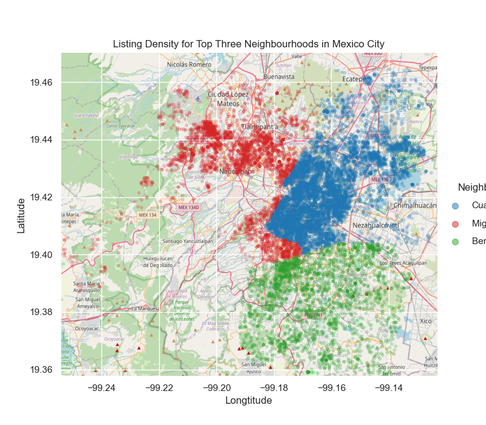
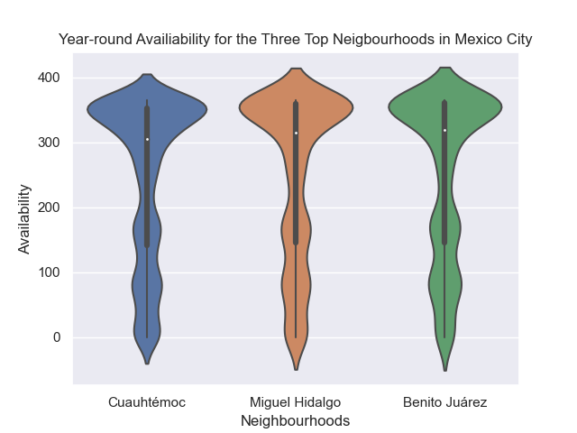
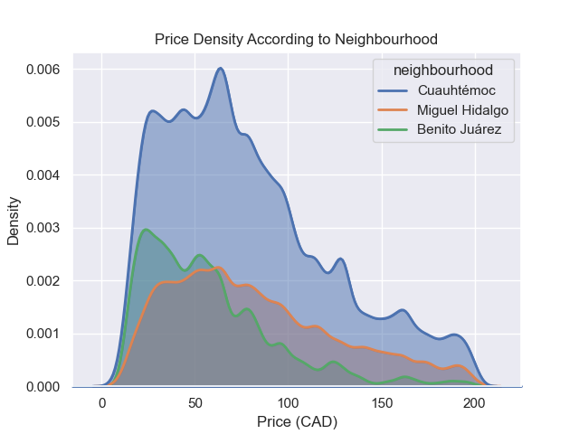

# Analysis of Airbnb Listings Across Three Major Cities: Tokyo, Mexico City, and Montreal

## **Question 2: For Mexico City, what neighbourhood would be best in terms of location and listing options?** 
 - This questions aims to help travellers on a budget that are unfamiliar with Mexico City, and hoping to book an Airbnb in a location with a high range of options, year-round availability, and within a reasonable price range.
 - The Analysis looks at three main factors: Listing density, Year-round availability, and price range
 
 ### Plot 1
 
 
 
 ### Factor 1: Listing Density

Given this geospatial plot of the top three neighbourhoods in Mexico City in terms of listing count, it is seen that the Cuauhtémoc neighbourhood (blue)  has the most dense listings compared to Benito Jaurez and Miguel Hidalgo. The listings for Miguel Hidalgo (red) and Benito Jaurez (green) are more spread out across the Mexico City region. As highlighted in the exploratory data analysis, Cuauhtémoc has the highest number of listings compared to all of the other neighbourhoods in Mexico City as well. Therefore, a travellor would find Cuauhtémoc to be the most favourable option due to the close proximity of listing options in the city centre.

### Plot 2

### Factor 2: Year-Round Availability

The second factor pertains to the availability that the top three neighbourhoods have year round. To analyze this factor, the availability of each listing out of a total of 365 days were plotted according to their respective neighbourhood location. From the violin plot, all three neighbourhoods have similar availability in terms of being available throughout the majority of the year. Since Cuauhtémoc is the most favourable in terms of listing density and count, its consitency of availability compared to the other two top neighbourhoods further emphasizes its favourability for travellers.

### Plot 3

### Factor 3: Price

The final factor to consider is price range. To determine how the top 3 neighbourhood compare in terms of price per night, Cuauhtémoc, Miguel Hidalgo, and Benito Juarez were plotted together to show where the density of prices lie in terms of their respective listings. This data was filtered by restricting the listings plotted to below two hundred dollars a night in order to best fit the financial needs of a traveller on a budget. As seen by the plot, all three neigbourhoods have the most dense listing options within the lower bound of this two hundred dollar range. Benito Juarez appears to have the most available listings within the under fifty dollar range, whereas Miguel Hidalgo and Cuauhtémoc have a slightly higher range. This plot shows that all three top neighbourhoods offer their listings within a reasonable price range of under two hundred dollars, thus making them attainable to a traveller on a budget.

### Conclusion

To conclude, it is seen that from the top three neigbourhoods in Mexico City, Cuauhtémoc has the most available listing options and within close proximity of eachother by a fairly significant amount compared to Migueal Hidalgo and Benito Jaurez. Along with this, Cuauhtémoc has year-round availabilty that is consitent with the other top neighbourhoods and a lower price range that is also competitve amoung other neighbourhood options. Given Cuauhtémoc's lisitng density, availability, and price range, it is clear that this neighbourhood offers the most options to travellers compared to other neighbourhoods that have similar features in terms of availability and price. Therefore, travellers looking to book an airbnb in Mexico City on a budget should consider the neighbourhood Cuauhtémoc for its options and availabilty of listings year-round.