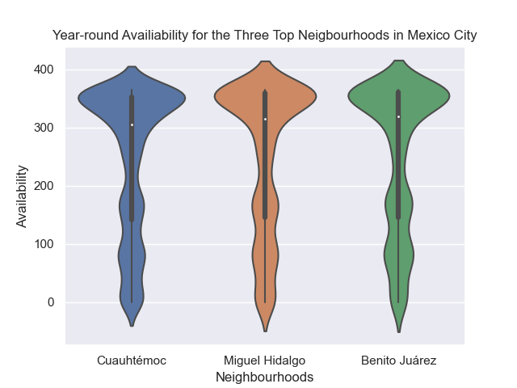
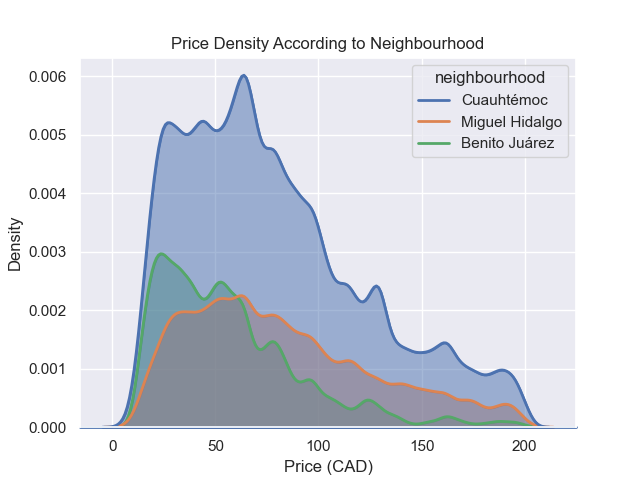

# Analysis of Airbnb Listings Across Three Major Cities: Tokyo, Mexico City, and Montreal

## Introduction

Our group has chosen to analyze Air bnb prices in major cities during 2022 in 3 major tourism cities to obtain information about the pricing in each city and help tourists, such as ourselves, to locate a high quality Air bnb rental at the most reasonable price.
 

## Exploratory Data Analysis  

Given that each of the three members in our team undertook slightly different approaches to each of our analyses, we are presenting our EDAs in three different sections below, separated by cities. 

### Analysis 1 - Tokyo (Harry)

During my EDA, a few findings which are worth highlighting are locating the neighbourhoods of interest, identifying the price outliers, and understanding and handling the exchange rate difference in pricings.

When I started my EDA, something that was not immediately obvious to me was that the majority of listings were located in a few neighbourhoods in Tokyo. Specifically, Tokyo has 46 unique neighbourhoods but the majority of listings are located in only a few neighbourhoods (per Figure 1.1). I believe that this uneven distribution is due to the varying levels of urbanization, different numbers of tourist attractions, and other factors that are directly or indirectly related to tourism in the city. Given that neighbourhoods with the most number of listings may be the most popular in terms of tourism, I have decided to focus my analysis on the top 10 neighbourhoods with the most listings, which reduced the amount of rows in my dataset from 9,736 to 7,438, meaning that listings in the top 10 neighbourhoods account for 76.4% of the total listings in Tokyo city and thus is representative for my analysis. 

#### Figure 1.1
 

Another discovery in my EDA is identifying the outliers within minimum nights requirement and listing price. According to Figure 1.2, though the majority of prices and minimum nights are located near a reasonable range, we have exaggerated input with 1,000 minimum nights requirement or near 800,000 pricing. These have been identified as outliers and have been removed in the data cleaning process.

#### Figure 1.2
 

Lastly, given the high rental pricing in all the Tokyo listings and information on the AirBnB website, I have identified that all the pricing in the dataset is given in Japanese Yen. Therefore, I have converted the pricing into Canadian dollars in my data cleaning process later based on prescribed rates on the Bank of Canada.  

### Analysis 2 - Mexico City (Aurora)
Using df.describe() I was able to locate columns with high maximums such as price and minimum nights, thus allowing me to drop outliers to a reasonable range for the purpose of my analysis - similar to the methods used in Analysis 1.

Given the multiple neighbourhoods available in terms of listings, I also wanted to determine if it would be reasonable to focus my analysis in terms of the most popular neighbourhoods in terms of listing count - as seem by Figure 2.1

**Figure 2.1**

From this listing count plot across all neighborhoods in Mexico City, it is seen that the top three neighbourhoods in terms of listing count are Cuatemoc, Miguel Hidalgo, and Benito Juarez. Through this exploration of data, the analysis can be better filtered to consider the top three neighbourhoods in terms of listing count in order to gain deeper insights for airbnb availability.

Once I was able to focus my analysis, additional procedures (similar to analysis 1) were taken by converting the price column from Mexican Pesos to Canadian Dollars using the prescribed rates per the Bank of Canada.

### Analysis 3 - Montreal (Steven)
-	I began by identifying a key column that I could use to group the listings. Based on my research question I selected the “Neighbourhood” column. other potentially useful columns were availability per year, latitude, and longitude.
- I also looked at the initial mean of the price and minimum_nights which were \$169.15 CAD and 15.36 nights.
-	I used df.describe( ) to check for MIN/MAX values for price and minimum_nights. This revealed outlier values which could be errors allowing me to remove them for the purpose of my analysis. I also removed any irrelevant columns and NaN Values.
-	Since my analysis is focused on neighbourhoods, I wanted to do some analysis here. Firstly, I found that there are 13913 values for 33 unique neighbourhood listed within Montreal’s Airbnb listings. 
-	Next, I sorted out the neighbourhoods based on number of listings, plotted them using a bar chart to see the top 3 neighbourhoods I should focus my research towards and dropped the other neighbourhoods.
-	Finally, I checked the longitude and latitude of the listing using a hexbin plot just to get a rough idea if the data provided is matching the real locations, which they do.
 

## Research Questions & Answers
### Analysis 1 - Tokyo (Harry)
**Question 1: I would like to explore the average, or most common price per night, that a traveller should expect when looking for an AirBnB rental in Tokyo city.**

**Figure 1.3**
 

 With all the outliers being dropped, the average price in the top 10 Tokyo neighborhoods comes down to \$161.22 CAD. This means that, when a tourist visits Tokyo city, they are most likely going to spend around \$161.22 CAD to stay one night in Tokyo. (see Figure 1.3)

**Question 2: I am also interested in seeing if there is a correlation between rental price & number of listings in a neighbourhood. Specifically, this could be done by comparing average prices from neighbourhoods that have a lot of air bnb rentals versus the ones that have barely any rentals.**

**Figure 1.4 Neighborhoods Vs Number of Listings**
 

**Figure 1.5 Neighborhoods Vs Price per Night**
 

**Figure 1.5 Neighborhoods Vs Price per Night**
 
According to Figure 1.4 and Figure 1.5, I believe there are **no correlations** between the number of listings in a neighbourhood and the average rental price per night. 

This is an interesting finding since I originally thought more listings in a certain neighbourhood (for example, Shinjuku Ku) will drive down rental prices in that area due to competitive pressure in the rental market. However, in reality, neighbourhoods with under 500 listings, such as Minato Ku and Chuo Ku, ended up with higher average pricing. I think this could be due to the smaller sample size, which allows a bigger impact on the average pricing from higher individual listings (per Figure 1.6, we can see that there are quite a few 600 to 1,000 dollars per night listings on Minato Ku and Chuo Ku's plots).

## Conclusion
In conclusion, I believe my analysis will provide helpful insights to tourists such as myself who plans to travel to Tokyo in the near future. Specifically, my analysis offers information on the average pricing per night and price distributions per neighborhoods, which may help tourists establish more accurate expectation on the AirBnB pricing and location when visiting Tokyo, and therefore improve their budgeting ability. 

#### Access to my Analysis File
You can [find the full analysis notebook here, including the code and the data here](https://github.com/ubco-W2022T2-data301/project-group-group21/blob/main/analysis/analysis1.ipynb)
 

## Analysis 2 - Mexico City (Aurora)
**Question: For Mexico City, what neighbourhood would be best in terms of location and listing options?** 
 - This question aims to help travellers on a budget that are unfamiliar with Mexico City, and hoping to book an Airbnb in a location with a high range of options, year-round availability, and within a reasonable price range.
 - The Analysis looks at three main factors: Listing density, Year-round availability, and price range
 
**Figure 2.2**
 
 
 
 #### Factor 1: Listing Density

Given this geospatial plot of the top three neighbourhoods in Mexico City in terms of listing count, it is seen that the Cuauhtémoc neighbourhood (blue)  has the most dense listings compared to Benito Jaurez and Miguel Hidalgo. The listings for Miguel Hidalgo (red) and Benito Jaurez (green) are more spread out across the Mexico City region. As highlighted in the exploratory data analysis, Cuauhtémoc has the highest number of listings compared to all of the other neighbourhoods in Mexico City as well. Therefore, a travellor would find Cuauhtémoc to be the most favourable option due to the close proximity of listing options in the city centre.

**Figure 2.3**

#### Factor 2: Year-Round Availability

The second factor pertains to the availability that the top three neighbourhoods have year round. To analyze this factor, the availability of each listing out of a total of 365 days were plotted according to their respective neighbourhood location. From the violin plot, all three neighbourhoods have similar availability in terms of being available throughout the majority of the year. Since Cuauhtémoc is the most favourable in terms of listing density and count, its consitency of availability compared to the other two top neighbourhoods further emphasizes its favourability for travellers.

**Figure 2.4**

#### Factor 3: Price

The final factor to consider is price range. To determine how the top 3 neighbourhood compare in terms of price per night, Cuauhtémoc, Miguel Hidalgo, and Benito Juarez were plotted together to show where the density of prices lie in terms of their respective listings. This data was filtered by restricting the listings plotted to below two hundred dollars a night in order to best fit the financial needs of a traveller on a budget. As seen by the plot, all three neigbourhoods have the most dense listing options within the lower bound of this two hundred dollar range. Benito Juarez appears to have the most available listings within the under fifty dollar range, whereas Miguel Hidalgo and Cuauhtémoc have a slightly higher range. This plot shows that all three top neighbourhoods offer their listings within a reasonable price range of under two hundred dollars, thus making them attainable to a traveller on a budget.

## Conclusion

To conclude, it is seen that from the top three neigbourhoods in Mexico City, Cuauhtémoc has the most available listing options and within close proximity of eachother by a fairly significant amount compared to Migueal Hidalgo and Benito Jaurez. Along with this, Cuauhtémoc has year-round availability that is consistent with the other top neighbourhoods and a lower price range that is also competitve among other neighbourhood options. Given Cuauhtémoc's lisitng density, availability, and price range, it is clear that this neighbourhood offers the most options to travellers compared to other neighbourhoods that have similar features in terms of availability and price. Therefore, travellers looking to book an airbnb in Mexico City on a budget should consider the neighbourhood Cuauhtémoc for its options and availability of listings year-round.

#### Access to my Analysis File
You can [find the full analysis notebook here, including the code and the data here](https://github.com/ubco-W2022T2-data301/project-group-group21/blob/main/analysis/analysis2.ipynb)

### Analysis 3 - Montreal (Steven)
[To begin, you can access the full analysis notebook here, including the code and data]( https://github.com/ubco-W2022T2-data301/project-group-group21/blob/main/analysis/analysis3.ipynb)

**Question 3: Which Montreal neighbourhood has the listings with the best price per minimum night stay?**
-	My research question is focused on finding out the neighbourhood within Montreal which offers the best prices compared to the minimum nights stay required per rental. 

**Figure 3.1**

I used this barplot as my first tool in answering my research question. I’ve chosen to focus on the top 3 neighbourhoods based on the number of listings because it should give me a greater sample size. The plot identifies that the top 3 neighbourhoods based on number of listings are: **Ville Marie, Le Plateau-Mont-Royal, and Rosemont-La-Petite-Patrie.** According to the plot, **Ville-Marie** has the greatest number of listings at around 3000 and gives me the initial belief that I will find the best price per night by minimum nights stay in this neighbourhood.

**Figure 3.2**

After identifying the top 3 neighbourhoods I wanted to get a visual representation to see the plots on a map and where they are located in respect to the rest of Montreal. This is important for my research question because the location of the neighbourhood may affect the price based on certain factors such as how close it is to the city center, how close it is to water, etc. After looking at the map, we can see that the plots are most abundant in the Ville-Marie Neighbourhood and the units are located near the water and span across the center.

**Figure 3.3**

For my final plot, I compared the price per nights stay vs the minimum nights stay per rental against the number of units per neighbourhood. What this plot is trying to show is the neighbourhood which contains the highest concentration of listings towards a lower price. In this case, it appears that all 3 neighbourhoods have fairly similar curves, however, the volume of listings for Ville-Marie is greater and has more listing skewed towards a lower price.

## Conclusion
After my initial belief that Ville-Marie would be the neighbourhood with the best price per minimum night stay, I appears that this is true. However, I learned that this is misleading as the price per night in Ville-Marie is based on a minimum nights stay of about 2. The neighbourhood of Rosemont-La-Petite-Patrie actually has a lower price per night but its average minimum nights stay is about 3 making it appear more expensive. 

To answer my research question, in Montreal, the neighbourhood of Ville-Marie provides the best price per night if you play on only staying 2 nights. Otherwise, if you are planning to stay 3 or more nights then Rosemont-La-Petite-Patrie is the more budget friendly neighbourhood and in the context of my research question, is the neighbourhood that I would book an Airbnb rental in.
